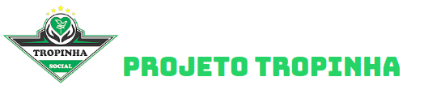
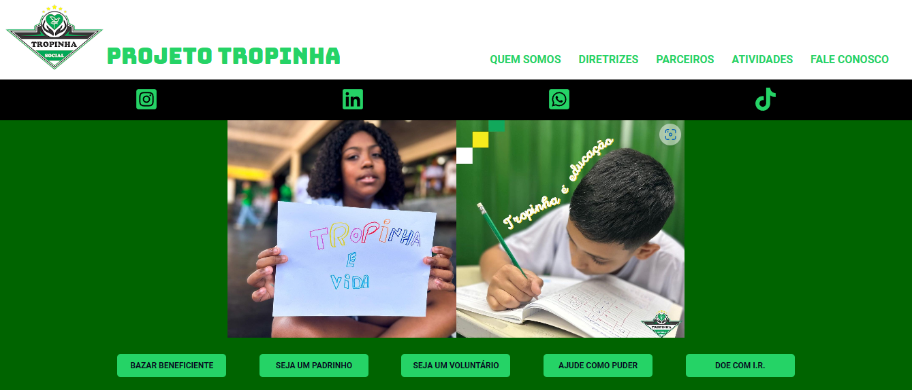
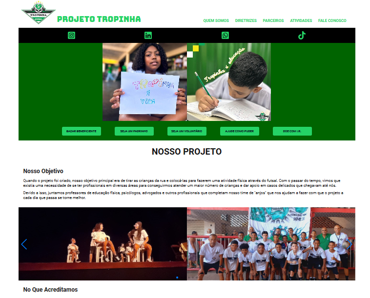
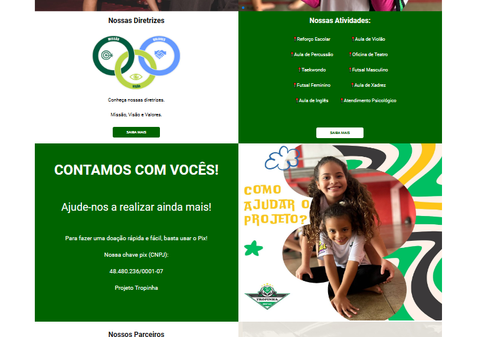
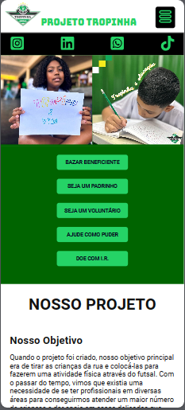
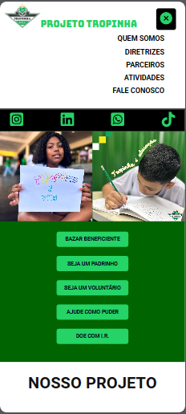

<hr>

### Tópicos

- [Descrição do projeto](#descrição-do-projeto)

- [Funcionalidades](#funcionalidades)

- [Layout](#layout)

- [Ferramentas utilizadas](#ferramentas-utilizadas)

- [Acesso ao projeto](#acesso-ao-projeto)

- [Abrir e rodar o projeto](#abrir-e-rodar-o-projeto)

- [Desenvolvedor](#desenvolvedor)

## Descrição do projeto

<p align="justify">
 Site desenvolvido para mostrar o projeto social da qual eu faço parte como voluntário, com o objetivo de conter todas as informações sobre o projeto, para que pessoas interessadas em fazer parte, ou ajudar de alguma forma, possa nos conhecer melhor, e ter acesso aos nossos canais de contato, através de links, de forma direta e simples.
  


</p>

## Funcionalidades

:heavy_check_mark: `Funcionalidade 1:` Informações sobre o Projeto.

:heavy_check_mark: `Funcionalidade 2:` Links diretos para nos ajudar e nos contactar, e navegação por diversas páginas.

:heavy_check_mark: `Funcionalidade 3:` Slide com fotos.

:heavy_check_mark: `Funcionalidade 4:` Design responsivo com tipos de menu diferentes, sendo menu tipo hamburguer para celular.
## Layout

<div align="center">





### Layout Responsivo

      

  </div>

###

## Ferramentas utilizadas

        

- React
- TypeScript
- JavaScript
- HTML
- Git
- Styled-Components

🎈 <i><b>OBS:</b></i> 

Foi utilizado o Styled-Components para evitar a repetição de códigos, visto que nos permite criar componentes reutilizáveis e compartilháveis, tornando manutenções e futuras mudanças mais simples. Foi usada bibliotecas do React, como React-Icons e React-Router-Dom para a navegação entre páginas.

## Acesso ao projeto

Você pode <a href="https://site-projeto-social-tropinha.vercel.app/" target="_blank">acessar o site do projeto.</a>

## Abrir e rodar o projeto

```cmd
# Clone este repositório
git clone <link do repositório>

# Acesse a pasta do projeto no seu terminal
cd <nome do projeto>

# Instalar dependências
npm install

# Execute a aplicação
npm start

```

## Desenvolvedor

[<br><sub>Bruno Dias de Freitas</sub>](https://www.linkedin.com/in/brunodias-dev)

